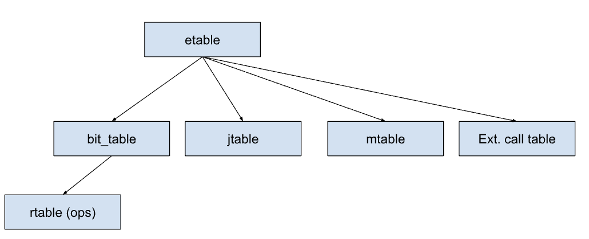

# Verification of zkWasm in Coq

This repository previews a Coq development to formally verify the [zkWasm](https://github.com/DelphinusLab/zkWasm) zkVM.
For more information about this project, also see our blog posts [Advanced Formal Verification of Zero Knowledge Proof Blockchains](https://www.certik.com/resources/blog/advanced-formal-verification-of-zero-knowledge-proof-blockchains), [Verifying a ZK Instruction](https://www.certik.com/resources/blog/advanced-formal-verification-of-zkp-verifying-a-zk-instruction), and [A Tale of Two Bugs](https://www.certik.com/resources/blog/advanced-formal-verification-of-zkp-a-tale-of-two-zk-bugs).


## Compiling the code

This release contains all definitions and the statements of the theorems, which shows exactly what has been proven. The proofs themselves have been omitted for now, and replaced with placeholders.

This release is based on an internal repo with commit hash `fb3bc5f33b8c18b367af34cdcaaab6bc9f456c74`, which does contain the corresponding proofs. This internal repo contains 33,080 lines of Coq (11,880 definitional, 21,200 proof) as counted by coqwc.

The development uses [WasmCert](https://github.com/WasmCert/WasmCert-Coq) to help specify the desired theorems. The easiest way to install both Coq and WasmCert is to use [opam](https://opam.ocaml.org/).

First install Coq 8.17.1. 

```shell
opam install coq=8.17.1
```

Then download WasmCert (check out the specific version we used) and install it.

```shell
git clone git@github.com:WasmCert/WasmCert-Coq.git
cd WasmCert-Coq; git checkout 3977eda9994a257dfd46e2904e0130504322e9e8
opam repo add coq-released https://coq.inria.fr/opam/released
opam install .
```

Two additional prerequisite dependencies are:

- [Mczify](https://github.com/math-comp/mczify): small Micromega arithmetic solvers for `MathComp` algebra used by WasmCert
- [Algebra Tactics](https://github.com/math-comp/algebra-tactics): tactics for solving algebraic structures defined in the `MathComp`

Use the following command to install both of them:

```shell
opam install coq-mathcomp-zify coq-mathcomp-algebra-tactics
```

Finally this repo can be compiled by

```shell
cd src
make
```

## Structure of zkWasm and Scope of the Verification Effort

ZkWasm is written in Rust, and relies on the Wasmi interpreter to execute wasm programs, and the Halo2 zk-prover to generate proof objects. In the setup phase zkWasm calls the Wasmi to compile the program and generate the initial "image" (containing the program code and global variable initializers). In the prover phase, it calls Wasmi to generate a program trace, which is encoded as field values to be assigned into various tables. It uses the Halo2 prover to generate the proof that the table values satisfy a set of arithmetic constraints (circuits).

The main table `ETable` represents each step of execution in the trace, while auxiliary tables are used to ensure the correctness of range checks (`RTable`), bitwise operations (`bit_table`), memory and control flow stack (`MTable`, `JTable`), and calls to external functions). By lines of code, the bulk of the circuits are about the etable, and those are divided into are divided into 27 files, representing different classes of Wasm instructions. For each row the zkWasm instruction decoding logic sets one of 27 bit-valued columns, which enables the corresponding instruction constraints.



The aim of the formal verification is to prove that the zkWasm circuits are sound with respect to the Wasm semantics. In other words, if all the circuit constraints are satisfied, each row in the ETable should represent a valid state in the execution of the program. On the other hand, everything except the Halo2 circuits themselves are considered out of scope and we do not prove anything about the algorithms written in Rust. Thus the zkWasm code that creates the tables is not verified (but it is not security-critical), Wasmi and Halo2 is out of scope, and some Rust code to programatically construct constraints is assumed to be correct (see section about allocation below). The verification covers all Wasm instructions implemented by zkWasm except for the "external call" one, because that one has no nontrivial constraints and is implemented entirely by custom Rust code.


|  Module      | status  |
|--------------|------ |
| rtable       | ✅ |
| image_table  | ✅ |
| mtable       | ✅ |
| jtable       | ✅ |
| etable/op_bin        |  ✅  |
| etable/op_bin_bit    |  ✅  |
| etable/op_bin_shift  |  ✅  |
| etable/op_const      |  ✅ | 
| etable/op_conversion |  ✅  |
| etable/op_drop       |  ✅  |
| etable/op_global_get |  ✅  |
| etable/op_global_set |  ✅  |
| etable/op_local_get  |  ✅  |
| etable/op_local_set  |  ✅  |
| etable/op_local_tee  |  ✅  |
| etable/op_load       |  ✅  |
| etable/op_store       | ✅  |
| etable/op_memory_grow  | ✅ |
| etable/op_memory_size  | ✅ |
| etable/op_rel         |  ✅ |
| etable/op_select      | ✅  |
| etable/op_test        | ✅  |
| etable/op_unary       | ✅  |
| etable/op_br         |  ✅ |
| etable/op_br_if      | ✅ |
| etable/op_br_if_eqz  | ✅ |
| etable/op_br_table   | ✅ |
| etable/op_call       |  ✅  |
| etable/op_call_host_foreign_circuit  | (not planned)   |
| etable/op_call_indirect              |  ✅  |
| etable/op_return      |  ✅  |
-----------------------------

## Machine Model

The Coq development can divided into two parts: a translation into Coq of the relevant zkWasm circuits (all the files with names ending in `Model.v`), and the correctness proofs about those circuits (the other files).

The model files were produced by translating the zkWasm code by hand. Our approach is a shallow embedding into Coq. Each of the Halo2 tables are postulated as `Parameter`s, e.g. we assume there is some function `bit_table_values` which maps each (column, row) pair to the contents of a cell in the BitTable. The circuits are then translated as a set `Axioms` about properties that the table satisfies.

```coq
Inductive bit_table_cols :=
  | block_sel
  | u32_sel
  | lookup_sel
  | op
  | helper
  | val_l
  | val_r
  | val_res.

Parameter bit_table_values : bit_table_cols -> Z -> Z.
Parameter bit_table_numRows : Z.
```

The axioms in the Model files thus represent the various constraints from the Rust files under `zkWasm/crates/zkwasm/blob/main/src/circuits/`.
Specifically there are four different sources of axioms: per-row gates (defined in the various `mod.rs` files), assignments to "fixed" columns in the tables (from the `assign.rs` files) and equality/permutation constraints between table cells (from various files but often `configure.rs`). Finally, there are also axioms representing assumptions we make about Wasmi behavior. The Model files have comments explaining where the various axioms come from.


### Translating gates

In order to translate the Halo2 circuits into Coq one could take two approaches: either modify Halo2 to pretty-print the circuit formulas, or manually translate them from the Rust code to equivalent Coq. We followed the latter approach, writing code that corresponds to the various Rust macros in zkWasm. The idea is that by keeping the Coq code similar to the Rust source code, rather than the processed circuits, it will be easier to understand the Coq development while working on it. Thus for example, the zkWasm Rust code fragment

```rust
macro_rules! acc_u32_if_popcnt {
    ($col:ident) => {
	fixed_curr!(meta, u32_sel)
	    * (acc_u32_helper!($col) - curr!(meta, $col))
	    * is_popcnt
    };
}


vec![
    compose_u32!(left),
    compose_u32!(right),
    compose_u32_if_bit!(result),
    acc_u32_if_popcnt!(result),
]
```
gets translated into similar Coq functions
```coq
Definition acc_u32_if_popcnt col :=
    (get u32_sel 0)
    * (acc_u32_helper col - (get col 0))
    * is_popcnt.

Axiom bit_table_gate_2 :
  gate bit_table
    (fun get =>
      compose_u32 get val_l ::
      compose_u32 get val_r ::
      compose_u32_if_bit get val_res ::
      acc_u32_if_popcnt get val_res :: nil).
```

We keep the Coq code line-by-line similar to the original circuit definition, in order to minimize the risk of translation mistakes. One difference is the `circuits/etable/mod.rs` file (609 lines of circuit code, out of about 6000 in total), which is written using a macro `sum_ops_expr_with_init` that manipulates syntactic expressions in a way that is hard to translate literally in a shallow embedding. The corresponding file ETableModel.v is therefore translated more loosely, although still gate-by-gate.

### Cell allocation and range axioms

The BitTable and JTable circuits are written directly against the Halo2 API, and we verify them at that level. But for ETable and MTable zkWasm uses an “allocator” approach where virtual columns are given offsets to pack them into a smaller number of Halo2 columns. For this verification we did not consider the allocation system, instead each “cell” in the Rust code is treated as a table column in the Coq code, and we again manually translate the gates. We believe this is a better use of verification engineer time, since the allocation code is less likely to have bugs.

The allocation code is also responsible for inserting lookup-constraints into the RTable to force numbers to be in certain ranges. Since we trust the allocation code, these are also modeled as direct axioms. For example, code in `etable/mod.rs` like
```rust
let enabled_cell = allocator.alloc_bit_cell();
let rest_mops_cell = allocator.alloc_common_range_cell();
```

is modeled by axioms like

```coq
Definition isbit c := forall i, mtable_values c i = 0 \/ mtable_values c i = 1.
Definition iscommon c := forall i, 0 <= mtable_values c i < common.

Axiom enabled_bit : isbit enabled_cell.
Axiom rest_mops_common : iscommon rest_mops_cell.
```

### Integer overflow

Currently the proofs mostly do not handle the possibility of overflows in the field arithmetic, i.e. the numbers are treated as integers rather than integers modulo p. This is to save proof effort in cases where it is clear form inspection that the values in the gates are so small that they will not overflow. However, we took care to model the modulo operation precisely in the cases we we thought it might be unclear: for all the "encoding" functions that packs multiple values into one integer, and for the OpBinModel.v  since arithmetic operations requires being particularly careful about overflow. The difference can be seen in two definitions `gate` (which assumes the gate expression values are small) versus `pgate` (which forces the proof engineer to prove the non-overflow). 

### Assumptions about the frontend and prover

We also need some assumptions which do not directly correspond to a particular line in source code: [about the size of the integers](https://github.com/CertiKProject/zkwasm-fv/blob/main/src/CommonModel.v#L14) used in the prover, [about the address of call instructions](https://github.com/CertiKProject/zkwasm-fv/blob/main/src/ETableModel.v#L1228), and [about two static call stack entries](https://github.com/CertiKProject/zkwasm-fv/blob/main/src/JTableModel.v#L158) created by Wasmi.

As a final caveat, in order to save proof effort we make a few assumptions about integer operations, see the file `IntegerFunctions.v`.

## Specification and proofs about the auxiliary tables.

### RTable

The RTable place several roles in zkWasm. As the name suggests, it has columns with numbers $0 ... common_range(k)$ (the "common range") and $0 ... 2^16-1$ (the "u16 range"), which are used by the allocator to enforce the range. In our development those constraints are axiomatized (see description of the Machine Model above), so we do not prove any lemmas about the range columns.

The other role of the table is to specify (in fixed columns) the result of arithmetic operations on bytes. We prove a set of correctness theorems saying that it computes And, Or, Xor, and powers-of-two correctly.

### BitTable

The  BitTable is used as a space to calculate the results of bitwise operations (AND, OR, XOR, POPCOUNT). Each bitwise operation in the execution trace generates several rows in the table, where the operation is computed on individual bytes, and the results are composed into the full words. We prove four correctness theorems stating that a row (op, input1, input2, result) is present in the table, the result is indeed the value of the operation applied to the two inputs. 

### MTable

The mtable is used to represent the state of memory, global variables, local variables and stack during the program execution. The functionality is to map 64-bit addresses to 64-bit words (and more complicated abstractions about e.g. byte-addressed memory) is built on top of this functionality. Each row in it has the form (eid_start, eid_end, adddress, value, ...), where the two first numbers are the index of the step in the trace that assigned that value to the address, and the index of the next assignment the address (which overwrites the value). In order to write constraints using memory zkWasm provides functions `alloc_memory_table_lookup_read_cell` and `alloc_memory_table_lookup_write_cell`, which create various Halo2 constraints about what rows should be present in the MTable.

Compared to the RTable and BitTable the specification is more complex. We define an operation [gather_entries eid](https://github.com/CertiKProject/zkwasm-fv/blob/main/src/MTable.v#L273) which returns a finite map representing the state of the memory at given `eid`. We then want to prove lemmas saying that if the "lookup read cell" constraints hold, then the read value is the same as what you get by reading from the `gather_entries` map, and smilarly if the "lookup write cells" constraints hold, the map at the next eid is updated in the expected way. 

However, in reality these results only hold if there are no “extra” entries in the memory table. ZkWasm ensures this by a counting scheme: there is a column in the MTable counting the total number of entries, there is a column in ETable tracking how many entries *should* be created by the instructions in the trace, and there is an equality constraint saying that these two counts are equal. Thus the correctness depends on a joint invariant between the MTable count, the ETable count, and the constraints for all the instructions. 

In order to verify this scheme in a modular way, we define a count (mops_at eid) counting the number of MTable entries created by a particular instruction.  The the MTable read and write theorems above get an extra precondition saying that the number of operations (mops_at eid typ) is 0 and 1 respectively. For each instruction we prove a lemma `opcode_mops_correct` which states that it creates *at least* as many MTable entries as expected. Then a lemma [mops_correct](https://github.com/CertiKProject/zkwasm-fv/blob/main/src/ETable.v#L83) uses this and the equality constraint to prove that each instruction created *exactly* as many MTable entries as expected, and finally the correctness proofs for individual instructions can use this information to prove that the read/writes behave as expected.

The proofs of the MTable correctness then requires proving the format of the table (in particular that it is sorted, see [mtable_sorted](https://github.com/CertiKProject/zkwasm-fv/blob/main/src/MTable.v#L58) in MTable.v) and that all the counts behave as expected.

### JTable

The JTable contains entries representing the entries on the call stack (i.e., the return address). There is a counting scheme similar to the MTable, and the proofs are similar, but we require a slightly more complicated invariant about the entries on the call stack (see [jtable_wellformedness](https://github.com/CertiKProject/zkwasm-fv/blob/main/src/ETable.v#L148) in ETable.v).


## Instruction specifications

The bulk of the formal verification consists of the correctness proofs for each of the Wasm instructions. The proofs vary in complexity. Some instructions, like pushing a constant onto the stack are quite simple, while loading and storing values in memory is complex because it needs to isolate particular bytes while the MTable is based around words. But however large the correctness proofs are, the final specifications look similar. A representative example is [the correctness theorem](https://github.com/CertiKProject/zkwasm-fv/blob/main/src/OpBinBit.v#L28) for the bitwise-AND instruction:

```coq
Theorem BitOp_And_correct : forall i st x1 x2 xs,
    0 <= i ->
    (etable_values enabled_cell i) = 1 ->
    mops_at_correct i ->
    etable_values (ops_cell BinBit) i = 1 ->
    etable_values op_class i = RTableModel.BitOp_And ->
    state_rel i st ->
    wasm_stack st = (Wasm_int.Z_of_uint i64m x1:: Wasm_int.Z_of_uint i64m x2::xs) ->
    state_rel (i+1) ((update_stack (incr_iid st) (Wasm_int.Z_of_uint i64m (Wasm_int.int_and i64m x2 x1) :: xs))).
```

Intuitively, we want to say that the ith row of ETable corresponds to the state of the Wasm machine after executing i instructions in the trace. What we prove is that for every type of instruction, the next row is calculated according to the Wasm semantics for that instruction. Thus, the full set of `XXX_correct` theorems implicitly defines a small-step operational semantics for Wasm.

As is standard, we define a operational semantics by making datatype representing states of the Wasm machine. It is in the file `Relation.v`: 

```coq
Record WasmState := {
    wasm_pc : label; (* program counter *)
    wasm_stack : list Z;
    wasm_globals : list Wasm.datatypes.global;
    wasm_memory : Wasm.datatypes.memory;
    wasm_callstack : list label
}.
```

The correctness theorem then works by defining a relation `state_rel i st`, which says that the `i`th row of the ETable represents the Wasm machine state `st`. The definition of the relation is in the same file.

If we consider the theorem statement again, it begins with the hypotheses `(etable_values enabled_cell i) = 1`, `etable_values (ops_cell BinBit) i = 1`, and `etable_values op_class i = RTableModel.BitOp_And`. These are columns in the ETable that specify which instruction is about to be executed. There are some "instruction decode" circuits relating these columns to the `iid` program counter and the program image table, but in this effort we did not formally verify the decode logic; it has been manually audited to make sure that each row has such a combination of decode columns that one of the instruction correctness theorems apply. (With some additional effort the decode logic could be verified also, but it seems less error prone than other circuits.)

Next there is precondition  `mops_at_correct i`. This was discussed above in the section about MTable, it is justified by the `mops_correct` lemma.

The rest of the theorem statement corresponds to [the official Wasm specification of t.binop](https://webassembly.github.io/spec/core/exec/instructions.html#exec-binop). It says to pop the two top values `x2` and `x1` off the stack, and instead push `AND x2 x1`. The other effect of the instruction is to increment the program counter `iid`. 

Notably, unlike the decode columns, the precondition about the stack doesn't cover all the cases, since we do not say what happens if the stack is empty. This corresponds to the statement in the Wasm specification that "Assert: due to validation, two values of value type are on the top of the stack". In other words, the responsibility of ensuring that the stack is well-formed lies with the Wasm type checker in Wasmi, not with the zkWasm circuits. Similar considerations apply accessing global variables (the type checker enforces that a suitable global location exists).


#### Re-using specifications from WasmCert

In order to avoid making mistakes when writing the statements of the instruction correctness theorems, we do not invent them independently. Instead we use the existing [WasmCert](https://github.com/WasmCert/WasmCert-Coq) specification of Wasm, which has been developed and validated by a team of researchers. In the above example one can see that we use the definition of the bitwise-AND operation (`int_and`) from WasmCert. This reuse is most important for the memory load and store operations, which are specified in terms of WasmCert's definitions of memory operation. The memory is probably the most complex part of specifying Wasm, so re-using existing work is helpful.

However, although we use the WasmCert auxiliary definitions we can not directly re-use the WasmCert operation semantics. This is because zkWasm doesn't implement the Wasm source language, but instead an intermediate language that Wasmi compiles into (see [this comment](https://github.com/DelphinusLab/wasmi/blob/659fcf7a84b1a67f6cbaa72cce7f953dc1580790/src/isa.rs) for an overview). The differences most relevant to us are:

* All control flow structures are flattened to plain gotos.
* Implicit returns via reaching function scope `End` are replaced with an explicit `return` instruction.
* Locals are allocated on on the value stack.

The control flow difference can be seen above: the instruction only manipulates simple "program counter" iid, instead of structured blocks. The locals can be seen in the specifications of LocalSet/LocalGet which are stack operations rather than accesses of a separate state, and also in the Return instruction (which pops values from the stack).

In addition to the differences between Wasm and the Wasmi ISA, there are also three places where our specifications disagree with WasmCert because the version of WasmCert we used is "wrong" or incomplete (they acknowledge this in comments in the source code).

* The WasmCert LOAD specification doesn't define sign extension, so we define our own [sign_extension](https://github.com/CertiKProject/zkwasm-fv/blob/main/src/OpLoadHelper.v#L137) function.
* The WasmCert `wasm_extend_s` function for CONVERSION operators is incomplete, so we define our [sign_extend](https://github.com/CertiKProject/zkwasm-fv/blob/main/src/OpConversion.v#L30)
* The WasmCert MEM_GROW specification works by comparing to some maximum amount of available memory, but the zkWasm circuit implementation can refuse one allocation and still allow another allocation later. The zkWasm behavior seems to be allowed by the English-language Wasm specification.
